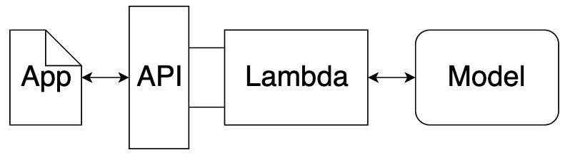

<script src="https://cdn.mathjax.org/mathjax/latest/MathJax.js?config=TeX-AMS-MML_HTMLorMML" type="text/javascript"></script>
<script type="text/x-mathjax-config">
    MathJax.Hub.Config({
        tex2jax: {
            skipTags: ['script', 'noscript', 'style', 'textarea', 'pre'],
            displayMath: [['$$','$$']],
            inlineMath: [['$','$']],
        },
    });
</script>

# Machine Learning in Production


## Endpoints and REST APIs

The interface (endpoint) facilitates an ease of communication between the model and the applicationion

One way to think of the endpoint that acts as this interface, is to think of a Python program where:

- The endpoint itself is like a function call
- The function itself would be the model and
- The Python program is the application.


```py
""" The whole script is the application"""
def main():
	input_user_data = get_user_data()

	# this is the interface
	predictions = ml_model(input_user_data)


def ml_model(data):
	""" This is the model"""
	loaded_data = load_user_data(data)
```

### REST API
Communication between the application and the model is done through the endpoint (interface), where the endpoint is an Application Programming Interface (API). The **REST API** is one that uses HTTP requests and responses to enable communication between the application and the model through the endpoint (interface).

- Endpoint

This endpoint will be in the form of a URL, Uniform Resource Locator, which is commonly known as a web address.

### HTTP Methods:
- GET: READ request action (retrieve information - of found is returned)
- POST: CREATE request action (create new info - once is created it's returned as a reposnse)
- PUT: UPDATE request action (there is also PATCH for partial update)
- DELETE: DELETE request action

The HTTP response sent from your model to your application is composed of three parts:

- HTTP Status Code

If the model successfully received and processed the user’s data that was sent in the message, the status code should start with a 2, like 200.

- HTTP Headers

The headers will contain additional information, like the format of the data within the message, that’s passed to the receiving program.

- Message (Data or Body)
What’s returned as the data within the message is the prediction that’s provided by the model. The user Data might need to be formatted (csv or json). The HTTP response message might need translations to be readable for the application's user (like csv or json).

The HTTP request that’s sent from your application to your model uses a POST HTTP Method.

## Containers

The model and the application can each be run in a container computing environment. The containers are created using a script that contains instructions on which software packages, libraries, and other computing attributes are needed in order to run a software application, in our case either the model or the application. 

A container can be thought of as a standardized collection/bundle of software that is to be used for the specific purpose of running an application. 

Three continer running three different applications:


Example of a [dockerfile](https://github.com/pytorch/pytorch/blob/master/docker/pytorch/Dockerfile), a file of instructions about how a container ccan be created.

Notes on containers:
- Containers are sharing the kernel with underlying OS, like VMs. They are though lighter.
- In order to install new software, we can update the build script for the container and run them again.
- With container we use microservices and we brek down things in smaller and managable units.

## Production environment
Deployment to production can simply be thought of as a method that integrates a machine learning model into an existing production environment so that the model can be used to make decisions or predictions based upon data input into this model. A production evironment can be a mobile or web application among others.

In machine learning, a **hyperparameter** is a parameter whose value cannot be estimated from the data. It is not directly learned through the estimators; therefore, their value must be set by the model developer. Often cloud platform machine learning services provide methods that allow for automatic hyperparameter tuning for use with model training.

### Model Deployment Characteristics
- Model Versioning
- Model Monitoring
- Model Updating (from change in the data) and Routing (the deployment platform should support routing differing proportions of user requests to the deployed models; to allow comparison of performance between the deployed model variants.

Routing in this way allows for a test of a model performance as compared to other model variants.)
- Model predictions: On-demand (real-time, as responses from a request, needs to have low latency) or Batch prediction (asynchronous, like high volume of requests with periodic submitions)


### SageMaker
- There are at least fifteen built-in algorithms that are easily used within SageMaker. Contains algorithms like linear learner or XGBoost, item recommendations using factorization machine, grouping based upon attributes using K-Means and more. You can also create custome algorithms, using popular ML algorithms.
- Make use of jupyter notebooks
- Has tuning tools and monitoring
- You must leave it running to provide predictions, so it's faster.

Other Notes
-  TensorFlow can be used for creating, training, and deploying machine learning and deep learning models. Keras is a higher level API written in Python that runs on top of TensorFlow, that's easier to use and allows for faster development. 
-  Scikit-learn and an XGBoost Python package can be used together for creating, training, and deploying machine learning models. 


## AWS Quotas and commands

### List your quotas, type pn AWL CLI:

`list-service-quotas` and `list-aws-default-service-quotas`

### Increase your quotas 
- Use amazon Service Quotas service. This service consolidates your account-specific values for quotas across all AWS services for improved manageability. Service Quotas is available at no additional charge. You can directly try logging into Service Quotas console here.
- Using AWS Support Center - You can create a case for support from AWS.
   command: `request-service-quota-increase`
- **Amazon SageMaker ML Instance Types**:characterized by a combination of CPU, memory, GPU, GPU memory, and networking capacity.
- **Shut Down SageMaker Instances, if not in use**. You can re-install it later.
- Read about the limits [here](https://docs.aws.amazon.com/general/latest/gr/sagemaker.html).

## Set up Instances
### Notebooks
- Amazon Saze Maker &rarr; Notebook Instances &rarr; Creat Notebook Instance
- Give the notebook a name, and a role (like a security acess level) under **Permissions and Encryption** &rarr; Create a new role &rarr; S3 buckets you specify: *None* &rarr; Create Notebook Instance
- Once the notebook instance is ready, amazon will automatically start it &rarr; **Stop it if you won't use it right away** - costs increases by the time

#### Notebooks with SageMaker
- When training in notebooks, sagemaker will create  VM with the characteristics we chose, then the VM will load an image in the form of a docker container, which contined the code to use XGBoost.
- The VM needs access to the data, which should be available in S3 (amazon data storage facilities), so need to upload our datasets there (by saving the dataset from the script). Then we upload by using sagemaker package:
- Sagemaker needs to be installed (can be done within a notebook with `!pip`)

```py
import sagemaker
session = sagemaker.Session()
session.upload_data(os.path.join(data_dir, 'test.csv'), key_prefix=prefix)
```
This uploads the file to the S3 bucket associated with this session.

- You can also print your role (defines how data that your notebook uses/creates will be stotred)
`print(role)`

- Different containers are created for different regions and models we choose to use. Amazon provides us with a function that can print the container uri, if we pass the region and the model as arguments:

```py
from sagemaker.amazon.amazon_estimator import get_image_uri
container = get_image_uri(session.boto_region_name, 'xgboost')
```
This will return something like:

```
'811284229777.dkr.ecr.us-east-1.amazonaws.com/xgboost:1'
```
Then we can train our model:
```py
# we create an estimator
# we want the estimator to have the appropriate role to access the data
xgb = sagemaker.estimator.Estimator(container, # The image name of the training container
                                    role,      # The IAM role to use (our current role in this case)
                                    train_instance_count=1, # The number of instances to use for training
                                    train_instance_type='ml.m4.xlarge', # The type of instance to use for training
                                    output_path='s3://{}/{}/output'.format(session.default_bucket(), prefix),
                                                                        # Where to save the output (the model artifacts)
                                    sagemaker_session=session) # The current SageMaker session

```
Then we can set the hyper parameters by:
```py
xgb.set_hyperparameters(max_depth=5,
                        eta=0.2,
                        gamma=4,
                        min_child_weight=6,
                        subsample=0.8,
                        objective='reg:linear',
                        early_stopping_rounds=10, # in case the model is overfitting and starts to make it worse in the validation set - we should sytop the model then
                        num_round=200)
```
Learn more about estimators [here](https://sagemaker.readthedocs.io/en/latest/estimators.html).
Then we can fit the model, by providing the location of the training/validation datasets:
```py
s3_input_train = sagemaker.s3_input(s3_data=train_location, content_type='csv')
s3_input_validation = sagemaker.s3_input(s3_data=val_location, content_type='csv')

xgb.fit({'train': s3_input_train, 'validation': s3_input_validation})
```
Lastly we fit the model. We send all the data to sagemaker, and it will decide how to split the data into train/val/test sets.

```py
# create the transformer
xgb_transformer = xgb.transformer(instance_count = 1, instance_type = 'ml.m4.xlarge')
# start the transform job
xgb_transformer.transform(test_location, content_type='text/csv', split_type='Line')
# check how the transformation jos is progressing
xgb_transformer.wait()
```
After the training is complete, we need to bring the output to our notebook. We'll use AWS's functionality to do that (still inside the notebook):

```
!aws s3 cp --recursive $xgb_transformer.output_path $data_dir
```

At the end we should remove the directory with the data (saved in `data_dir`), to free up space for the rest of our prpojects:

```
# First we will remove all of the files contained in the data_dir directory
!rm $data_dir/*

# And then we delete the directory itself
!rmdir $data_dir
```
## Launch a project
An example is [here](https://github.com/udacity/sagemaker-deployment).  


### Modeling on SageMaker
Notes:

- XGBoost is a tree based method, so prone to overfitting. Having a validation set for those kind of models can improve results.
- After uploading data in S3, the files can be found here:
AWS &rarr; S3 &rarr; Choose bucket. There should be the folder with the datasets uploaded.uploaded
- A sagemaker model is a collection of information that includes both a link to the model artifacts (saved files created by the training job, if we were fitting a linear model then the coefficients that were fit would be saved as model artifacts) and some information in how those srtifacts should be used.
We can also add all the nessesary params in a dictionary and unpack them in the job func:
- We can create training jobs. After a trining job is completed, we can build a sagemaker model.
- After the model is complete, we can test it, by using transform (like before).

Training job:
```py
training_job = sessions.sagemaker_client.create_training_job(**training_params)
# to check the logs of the session
session.logs_for_job(training_job_name)
```

Testing job:
```py
# use the transform_request dict with all the informtion about the continer, VM and model
transform_response = session.agemaker_client.create_transform_job(**transform_request)
# check the logs - transform name to be unique, str
transform_desk = ession.wait_for_transform_job(transform_job_name)
```
#### What happend when a model is fit using SageMaker?
When a model is fit using SageMaker, the process is as follows.

First, a compute instance (basically a server somewhere) is started up with the properties that we specified.

Next, when the compute instance is ready, the code, in the form of a container, that is used to fit the model is loaded and executed. When this code is executed, it is provided access to the training (and possibly validation) data stored on S3.

Once the compute instance has finished fitting the model, the resulting model artifacts are stored on S3 and the compute instance is shut down.

You can check the jobs in the AWS console: Underneath the Notebook Instances in AWS Sagemaker, click om Training Jobs. Click on a training job, will reaveal information about the job.There, theres is also a `View logs` option.

## Deploy a model with SageMaker
Instead of testing the model with the transform method, we will deploy our model and then send the test data to the endpoint.
Deployment means creating an endpoint, which is just a URL that we can send data to.
The only thing we need to do to deploy it in an application, is to just call `deploy()` in our existing model (after training). This will start the endpoint and the **charging** will start:
```py
# we need to pass the number of VMs we want to use, and the type of the VM
xgb_preedictor = xgb.deploy(initial_instance_count=1, instance_type='ml.m4.xlarge')
```
SageMaker has now created a VM that has ran the trained model, that it now accessed by an endpoint (URL).

In order to send data to the model's endpoint, we can use the `predict` method of the xgd_predictor object that returned above. The data the we provide to the predictor object need to serialized first. We can do that with the sagemaker's `csv_serializer`. the returned results is also serialized (a string), so we'll need to convert it back to numpy.array:

```py
# We need to tell the endpoint what format the data we are sending is in
xgb_predictor.content_type = 'text/csv'
xgb_predictor.serializer = csv_serializer

Y_pred = xgb_predictor.predict(X_test.values).decode('utf-8')
# predictions is currently a comma delimited string and so we would like to break it up
# as a numpy array.
Y_pred = np.fromstring(Y_pred, sep=',')
```

Lastly **we need to shut down the deployed model**, as it  will run, waiting for data to be send to it:

```py
xgb_predictor.delete_endpoint()
```

To do the above in mode detail (configure the endpoint), go to the low-level deployment tutorial of the course.
Endpoit configuration objects are also available in **SageMaker menu** &rarr; **Endpoint configurations**. After its creation, we can use the same configuration as many times as we want.

Once the endpoint is created, we can see it Under **SageMaker menu** &rarr; **Endpoints**, where we can see the URL, or delete our endpoint. Then we can test the model (send the data to endpoint)
Notes
- SageMaker gets the data to the endpoint, and if we want it to, split the data amongst different models.
- In case you need to aplit the data before feeding them into the model, use :
```py
# We split the data into chunks and send each chunk seperately, accumulating the results.

def predict(data, rows=512):
    split_array = np.array_split(data, int(data.shape[0] / float(rows) + 1))
    predictions = ''
    for array in split_array:
        predictions = ','.join([predictions, xgb_predictor.predict(array).decode('utf-8')])
    
    return np.fromstring(predictions[1:], sep=',')
```

# Hyperparameters Tuning

- SageMaker can run a bunch of models and choose the best one. We have to define how many models to runand the best model method (like rmse).
- To check the output of the model, check **Cloud Watch**. (logs I mentioned earlier)

Wee need a model as we have done so far, and we set the hyper parameters like before. This will be our basline model:

```py
# set a baseline object
xgb.set_hyper_parameters(max_depth=5,
                        eta=0.2,
                        gamma=4,
                        min_child_weight=6,
                        subsample=0.8,
                        objective='reg:linear',
                        early_stopping_rounds=10,
			num_round=200)
```

Then we create another object that will tune the parameters above and we fit the tuner:

```py
xgb_hyperparameter_tuner = HyperparameterTuner(estimator = xgb, # The estimator object to use as the basis for the training jobs.
                                               objective_metric_name = 'validation:rmse', # The metric used to compare trained models.
                                               objective_type = 'Minimize', # Whether we wish to minimize or maximize the metric.
                                               max_jobs = 20, # The total number of models to train
                                               max_parallel_jobs = 3, # The number of models to train in parallel
                                               hyperparameter_ranges = {
                                                    'max_depth': IntegerParameter(3, 12),
                                                    'eta'      : ContinuousParameter(0.05, 0.5),
                                                    'min_child_weight': IntegerParameter(2, 8),
                                                    'subsample': ContinuousParameter(0.5, 0.9),
                                                    'gamma': ContinuousParameter(0, 10),
                                               })
# load data tp s3
s3_input_train = sagemaker.s3_input(s3_data=train_location, content_type='csv')
s3_input_validation = sagemaker.s3_input(s3_data=val_location, content_type='csv')
# fit the tuner
xgb_hyperparameter_tuner.fit({'train': s3_input_train, 'validation': s3_input_validation})
```
 To check the nest model:
```py
xgb_hyperparameter_tuner.best_training_job()
```

At the moment we have trained the tuner, but not the initial estimator. In order to do that, we can attach the tuner to the estimator. We can choose the best training model:
```py
xgb_attached = sagemaker.estimator.Estimator.attach(xgb_hyperparameter_tuner.best_training_job())
```

Then we can test our best model.

If we want to use the API, we can do it by defining more details option for the container and the model, the only difference will be that instead of setting up the parameters of the baseline mode, we will only refer to the ones that will remain static, and later one we can define the ranges for the parameters that will vary.


## Deploy a Sentiment Analysis Model
### Bag of words
In the project, we'll use the bag-of-words approach to determinte if a movie feedback is positive or negative.

- Turn each document (or a sentense) into a vector of numbers:

We can compare two documents based on how many words they have in common. The mathematical repressentation is:

$$a\cdotb = \Sigma(a_0 b_0i + a_1 b_1 + ... + a_n b_n) = 1$$

The greater the product, the mode similar the documents. The issue is that different pairs my end up having the same product. In that case, we the *cosine similarity*:

$$cos(θ) = \frac{a\cdot b}{|a|\cdot|b|}$$

## Web app for the model to be deployed

Issues you need to overcome:
- The endpoind takes encoded data as input, but the user input on the web app is a string.
- Security - endpoints provided by sagemaker give access only to users authenticated with AWS credentials.

To overcoms those issues si an overkill for a simple application, so we'll create a new endpoints ourselves.

Structure of the web app:


## Set up the App
Instead of creating a server, we can tell AWS to only run a function and get charged only for when the fucntion runs. After creating an endpoint method (IMDB Sentiment Analysis - XGBoost - WebApp tutorial notebook), we invoke the endpoint, then serialize and send the data to it. First, we prepare the data:

```py
import re

test_review = "Nothing but a disgusting materialistic pageant of glistening abed remote control greed zombies

REPLACE_NO_SPACE = re.compile("(\.)|(\;)|(\:)|(\!)|(\')|(\?)|(\,)|(\")|(\()|(\))|(\[)|(\])")
REPLACE_WITH_SPACE = re.compile("(<br\s*/><br\s*/>)|(\-)|(\/)")

def review_to_words(review):
    words = REPLACE_NO_SPACE.sub("", review.lower())
    words = REPLACE_WITH_SPACE.sub(" ", words)
    return words

test_words = review_to_words(test_review)

# create a bag of words embedding of the test_words
# words is the string cleaned from html symbols
# vocabulary is the most fewquently appearing words in a document
def bow_encoding(words, vocabulary):
    bow = [0] * len(vocabulary) # Start by setting the count for each word in the vocabulary to zero.
    for word in words.split():  # For each word in the string
        if word in vocabulary:  # If the word is one that occurs in the vocabulary, increase its count.
            bow[vocabulary[word]] += 1
    return bow
test_bow = bow_encoding(test_words, vocabulary)
```

To invoke the endpoint, we need to have th data converted to csv format, as this is what that function expects:
```py
body = ','.join([str(val) for val in test_bow]).encode('utf-8'))
response = runtime.invoke_endpoint(EndpointName = xgb_predictor.endpoint, # The name of the endpoint we created
                                       ContentType = 'text/csv',                     # The data format that is expected
                                       Body = body)
```
we are most interested in is 'Body' object:

```py
response = response['Body'].read().decode('utf-8')
```
Make sure you **shut down the endpoint**:
```py
xgb_predictor.delete_endpoint()
```
### Set up the Lamba fuctnion: a function as a service
We need to give the lamba function permissio to use a SageMaker endpoint.

* First we'll set up a new role for Lamba func:

Amazon Console &rarr; Secutiry, Identity and Compiance &rarr; IAM &rarr; Roles &rarr; Create Role &rarr; Lamba &rarr; Next &rarr; Check AmazonSageMalerFullAccess &rarr; Next &rarr; Create a LambaSageMakerRole.

* Then we'll create a function:
Amazon Conseol &rarr; Compute &rarr; Lamba &rarr; Create a function &rarr; Author from scratch &rarr; Name: sentiment_lamba_function &rarr; Runtime: Python 3.6 &rarr; Role: Choose an existing role, LambaSageMaKerRole &rarr; Create

Scroll down to see the funtion (emty for now). We can copy and paste the function from the notebook:
```py
# We need to use the low-level library to interact with SageMaker since the SageMaker API
# is not available natively through Lambda.
import boto3

# And we need the regular expression library to do some of the data processing
import re

REPLACE_NO_SPACE = re.compile("(\.)|(\;)|(\:)|(\!)|(\')|(\?)|(\,)|(\")|(\()|(\))|(\[)|(\])")
REPLACE_WITH_SPACE = re.compile("(<br\s*/><br\s*/>)|(\-)|(\/)")

def review_to_words(review):
    words = REPLACE_NO_SPACE.sub("", review.lower())
    words = REPLACE_WITH_SPACE.sub(" ", words)
    return words

def bow_encoding(words, vocabulary):
    bow = [0] * len(vocabulary) # Start by setting the count for each word in the vocabulary to zero.
    for word in words.split():  # For each word in the string
        if word in vocabulary:  # If the word is one that occurs in the vocabulary, increase its count.
            bow[vocabulary[word]] += 1
    return bow


def lambda_handler(event, context):

    vocab = "*** ACTUAL VOCABULARY GOES HERE ***"

    words = review_to_words(event['body'])
    bow = bow_encoding(words, vocab)

    # The SageMaker runtime is what allows us to invoke the endpoint that we've created.
    runtime = boto3.Session().client('sagemaker-runtime')

    # Now we use the SageMaker runtime to invoke our endpoint, sending the review we were given
    response = runtime.invoke_endpoint(EndpointName = '***ENDPOINT NAME HERE***',# The name of the endpoint we created
                                       ContentType = 'text/csv',                 # The data format that is expected
                                       Body = ','.join([str(val) for val in bow]).encode('utf-8')) # The actual review

    # The response is an HTTP response whose body contains the result of our inference
    result = response['Body'].read().decode('utf-8')

    # Round the result so that our web app only gets '1' or '0' as a response.
    result = round(float(result))

    return {
        'statusCode' : 200,
        'headers' : { 'Content-Type' : 'text/plain', 'Access-Control-Allow-Origin' : '*' },
        'body' : str(result)
    }
```
We had defined the vocabulary here (in the notebook):
```py
train_X, test_X, vocabulary = extract_BoW_features(train_X, test_X)
```
We'll need to replace the `***ENDPOINT NAME HERE***` with the results of `xgb_preedictor.endpoint` and the `*** ACTUAL VOCABULARY GOES HERE *** with `vocabulary`. Click on Save.


Create a test event to test it: Dropdown menu &rarr; Configure test events &rarr; Create new test event &rarr; Event template: API Gateaway AWS Proxy &rarr; Event name: testEvent

Here we can replace `{"body": "test.csv"` with `{"body": "This movie is horrible."`. Then clikc on test. In order for ou website to use it we need to create an endpoint.

### Building an API

To create an endpoint for the lambda function go to:
Amazon console &rarr; Networking & Content Delivery &rarr; API Gateaway &rarr; Get Started &rarr; OK &rarr; New API &rarr; API name: sentimentAnalysis &rarr; Create API

The API currently doesn't do anything, so we'll need to create some actions:
Actions &rarr; Create method &rarr; POST &rarr; click on the checkmark

Next we configure our POST action:
Integration type: Lambda Function &rarr; Check Use Lambda Proxy integration (so it will not do any check on the input data ) &rarr; Lambda Function: sentiment_lambda_function &rarr Save

Now we also need to deploy the API:
Actions &rarr; Deploy API &rarr; Depoy Stage(environment to deploy to): [New Stage] &rarr; Stage Name: prod &rarr; Deploy

On the top the `URL` will appear. If we send a post request to thie URL, the body of the URL will be sent to our lambda function and our lambda function will return the results of our model. 


## Launch the Web App
We are ready to launch our web app. To get the URL of the app, go to:
API Gateawa &rarr; sentimentAnalysis &rarr; Stages and the URL is on the top. Copy it. Going back to the IMDB Sentiment Analysis notebook (in Tutorials), select the `index.html` and edit it. Under the form tag, we replace the `action` var with our URL. If we save it, the web app is ready. Check the `index.html`, download and open the file. The app should be working as expected. Type a few reviews and run the model.

Make sure you **SHUT DOWN** the endpoint. Can be doen through the notebook as before, or the console.

We also need to delete the Lamba function and the API.

To delete the Lambda function go to:
Amazon Console &rarr; Compute &rarr; Lambda &rarr; check sentiment_lambda_function &rarr; Actions &rarr; Delete &rarr; Delete

To delete the API go to:
Amazon Console &rarr; Networking and Content Delivery &rarr; API Gateaway &rarr; sentimentAnalysis &rarr; Actions &rarr; Delete API &rarr; type the name to cofirm deletion

## Update a model with no downtime
We can update our model with no downtine, and we can also feed data to multiple models.
We go with the low-level option for this model, so we can have more contol over the model (Boston Housing - Updating an Endpoint).

After fitting the model (we haven't created the model YET), we set up the configuration of the container:

```py
xgb_model_name = "boston-update-xgboost-model" + strftime("%Y-%m-%d-%H-%M-%S", gmtime())

# We also need to tell SageMaker which container should be used for inference and where it should
# retrieve the model artifacts from. In our case, the xgboost container that we used for training
# can also be used for inference and the model artifacts come from the previous call to fit.
xgb_primary_container = {
    "Image": xgb_container,
    "ModelDataUrl": xgb.model_data
}
```
And we create the model:
```py
# And lastly we construct the SageMaker model
xgb_model_info = session.sagemaker_client.create_model(
                                ModelName = xgb_model_name,
                                ExecutionRoleArn = role,
                                PrimaryContainer = xgb_primary_container)
```
Create the endpoint configuration
```py
xgb_endpoint_config_name = "boston-update-xgboost-endpoint-config-" + strftime("%Y-%m-%d-%H-%M-%S", gmtime())

# And then we ask SageMaker to construct the endpoint configuration
xgb_endpoint_config_info = session.sagemaker_client.create_endpoint_config(
                            EndpointConfigName = xgb_endpoint_config_name,
                            ProductionVariants = [{
                                "InstanceType": "ml.m4.xlarge",
                                "InitialVariantWeight": 1,
                                "InitialInstanceCount": 1,
                                "ModelName": xgb_model_name,
                                "VariantName": "XGB-Model"
                            }])
```
And create and deploy the endpoint:
```py
# Again, we need a unique name for our endpoint
endpoint_name = "boston-update-endpoint-" + strftime("%Y-%m-%d-%H-%M-%S", gmtime())

# And then we can deploy our endpoint
endpoint_info = session.sagemaker_client.create_endpoint(
                    EndpointName = endpoint_name,
                    EndpointConfigName = xgb_endpoint_config_name)
```
Finaly, get results back and get the body:

```py
response = session.sagemaker_runtime_client.invoke_endpoint(
                                                EndpointName = endpoint_name,
                                                ContentType = 'text/csv',
                                                Body = ','.join(map(str, X_test.values[0])))
result = response['Body'].read().decode("utf-8")
```
We can make and deploy a  second model in the same way we have created the first one, using the exact same endpoint.

### Deply a combined model
n order for us to compare our two models, we can perform an **AB test**. We create a new endpoint, and the the endpoint can decide which model to send the data to. we can use both models on its own production variable. The amount of data to be sent to each model, is determined by the initial variant weight:

```py
# As before, we need to give our endpoint configuration a name which should be unique
combined_endpoint_config_name = "boston-combined-endpoint-config-" + strftime("%Y-%m-%d-%H-%M-%S", gmtime())

# And then we ask SageMaker to construct the endpoint configuration
combined_endpoint_config_info = session.sagemaker_client.create_endpoint_config(
                            EndpointConfigName = combined_endpoint_config_name,
                            ProductionVariants = [
                                { # First we include the linear model
                                    "InstanceType": "ml.m4.xlarge",
                                    "InitialVariantWeight": 1,
                                    "InitialInstanceCount": 1,
                                    "ModelName": linear_model_name,
                                    "VariantName": "Linear-Model"
                                }, { # And next we include the xgb model
                                    "InstanceType": "ml.m4.xlarge",
                                    "InitialVariantWeight": 1,
                                    "InitialInstanceCount": 1,
                                    "ModelName": xgb_model_name,
                                    "VariantName": "XGB-Model"
                                }])
```
We can check the endpoint information by:
```py
print(session.sagemaker_client.describe_endpoint(EndpointName=endpoint_name))
```

If we want to change the endpoint to only send data to the linear model, we can do that with `sagemaker_client.update_endpoint`:
```py
session.sagemaker_client.update_endpoint(EndpointName=endpoint_name, EndpointConfigName=linear_endpoint_config_name)
```
Sagemaker will be reconfigure the endpoint to only have only one production variant, and we will not have any downtime.

## Looking at new Data
After training and deploying our model, we want to do a quality control of our model, to make sure the accuracy is still in the same levels. To do that we collect a bunch of reviews from our endpoint and label them by hand, and then see what our model says about them.(from mimmi-projects, IMDB Sentiment analysis - XGBoost (Updating a model) notebook)
We need to encode them and also to make sure that similar words have the same token. Our vocabulary is the most frequent words, and then we cound the number of each of those words. We need to create our bag of words encoding and then train and create the model as we normally do:
```py
import new_data

new_X, new_Y = new_data.get_new_data()
vectorizer = CountVectorizer(vocabulary=vocabulary,
                preprocessor=lambda x: x, tokenizer=lambda x: x)

#Transform our new data set
new_XV = vectorizer.transform(new_X).toarray()
pd.DataFrame(new_XV).to_csv(os.path.join(data_dir, 'new_data.csv'), header=False, index=False)

# upload data
new_data_location = session.upload_data(os.path.join(data_dir, 'new_data.csv'), key_prefix=prefix)

xgb_transformer.transform(new_data_location, content_type='text/csv', split_type='Line')
xgb_transformer.wait()

```
Copy the data to our locar instance
```
!aws s3 cp --recursive $xgb_transformer.output_path $data_dir
```
and check the performance on the new data:
```py
predictions = pd.read_csv(os.path.join(data_dir, 'new_data.csv.out'), header=None)
predictions = [round(num) for num in predictions.squeeze().values]

accuracy_score(test_Y, predictions)

```
If we are seeing a lower performance than before, we need to investigate the reviews that have been missclassified.
```py
from sagemaker.predictor import csv_serializer

# We need to tell the endpoint what format the data we are sending is in so that SageMaker can perform the serialization.
xgb_predictor.content_type = 'text/csv'
xgb_predictor.serializer = csv_serializer

# generator
def get_sample(in_X, in_XV, in_Y):
    for idx, smp in enumerate(in_X):
        res = round(float(xgb_predictor.predict(in_XV[idx])))
        if res != in_Y[idx]:
            yield smp, in_Y[idx]

gn = get_sample(new_X, new_XV, new_Y)
print(next(gn))
gn = get_sample(new_X, new_XV, new_Y)

```
Check if the corresponding vocabulary has changed
```py
new_vectorizer = CountVectorizer(max_features=5000,
                preprocessor=lambda x: x, tokenizer=lambda x: x)
new_vectorizer.fit(new_X)
original_vocabulary = set(vocabulary.keys())
new_vocabulary = set(new_vectorizer.vocabulary_.keys())

print(original_vocabulary - new_vocabulary)
print(new_vocabulary - original_vocabulary)```
```
We might also need to chenge the vocabulary in the lambda functions we created earlier.

Encode our dataset:
```py
new_XV = new_vectorizer.transform(new_X).toarray()
```
And split them
```py
new_val_X = pd.DataFrame(new_XV[:10000])
new_train_X = pd.DataFrame(new_XV[10000:])

new_val_y = pd.DataFrame(new_Y[:10000])
new_train_y = pd.DataFrame(new_Y[10000:])
```

And save them locally:
```py
pd.DataFrame(new_XV).to_csv(os.path.join(data_dir, 'new_data.csv'), header=False, index=False)

pd.concat([new_val_y, new_val_X], axis=1).to_csv(os.path.join(data_dir, 'new_validation.csv'), header=False, index=False)
pd.concat([new_train_y, new_train_X], axis=1).to_csv(os.path.join(data_dir, 'new_train.csv'), header=False, index=False)
```
Make sure you set not nessesary vars to None

Now you can crete the model:
```py
new_xgb = sagemaker.estimator.Estimator(container, # The location of the container we wish to use
                                    role,                                    # What is our current IAM Role
                                    train_instance_count=1,                  # How many compute instances
                                    train_instance_type='ml.m4.xlarge',      # What kind of compute instances
                                    output_path='s3://{}/{}/output'.format(session.default_bucket(), prefix),
                                    sagemaker_session=session)

# set the algorithm specific parameters
new_xgb.set_hyperparameters(max_depth=5,
                        eta=0.2,
                        gamma=4,
                        min_child_weight=6,
                        subsample=0.8,
                        silent=0,
                        objective='binary:logistic',
                        early_stopping_rounds=10,
                        num_round=500)

s3_new_input_train = sagemaker.s3_input(s3_data=new_train_location, content_type='csv')
s3_new_input_validation = sagemaker.s3_input(s3_data=new_val_location, content_type='csv')

new_xgb.fit({'train': s3_new_input_train, 'validation': s3_new_input_validation})
```

Finally, test the new model. This is data likeage, as we test in the same it has been trained, but we ONLY do that for comparison with the previous data.
```py
new_xgb_transformer = new_xgb.transformer(instance_count = 1, instance_type = 'ml.m4.xlarge')
new_xgb_transformer.transform(new_data_location, content_type='text/csv', split_type='Line')
new_xgb_transformer.wait()

# Copy the results to our local instance.
!aws s3 cp --recursive $new_xgb_transformer.output_path $data_dir

# And see how well the model did.

predictions = pd.read_csv(os.path.join(data_dir, 'new_data.csv.out'), header=None)
predictions = [round(num) for num in predictions.squeeze().values]

accuracy_score(new_Y, predictions)```


We might as well want to chek whether our model is behaving ok relatively to the old data, as we don't expect the disctribution of the data has changed that much. 

We follow the similar process for the old data:

```py
cache_data = None
with open(os.path.join(cache_dir, "preprocessed_data.pkl"), "rb") as f:
            cache_data = pickle.load(f)
            print("Read preprocessed data from cache file:", "preprocessed_data.pkl")
            
test_X = cache_data['words_test']
test_Y = cache_data['labels_test']

# Here we set cache_data to None so that it doesn't occupy memory
cache_data = None
```

Create a bag-of-words encoding and upload them:
```py
test_X = new_vectorizer.transform(test_X).toarray()
pd.DataFrame(test_X).to_csv(os.path.join(data_dir, 'test.csv'), header=False, index=False)
test_location = session.upload_data(os.path.join(data_dir, 'test.csv'), key_prefix=prefix)
```
Test the model again:
```py
new_xgb_transformer.transform(test_location, content_type='text/csv', split_type='Line')
new_xgb_transformer.wait()
!aws s3 cp --recursive $new_xgb_transformer.output_path $data_dir
predictions = pd.read_csv(os.path.join(data_dir, 'test.csv.out'), header=None)
predictions = [round(num) for num in predictions.squeeze().values]
accuracy_score(test_Y, predictions)
```
If our model is performing well in both old and new data, we can update the model as before. Remember, in order to update en endpoint, we need to crete a new endpoint configuration, and we need to know the name of the mode. Make sure you delete the endpoint at the end. Also make sure you delete any notebook, s3 bucket, lambda or API Gateway.


